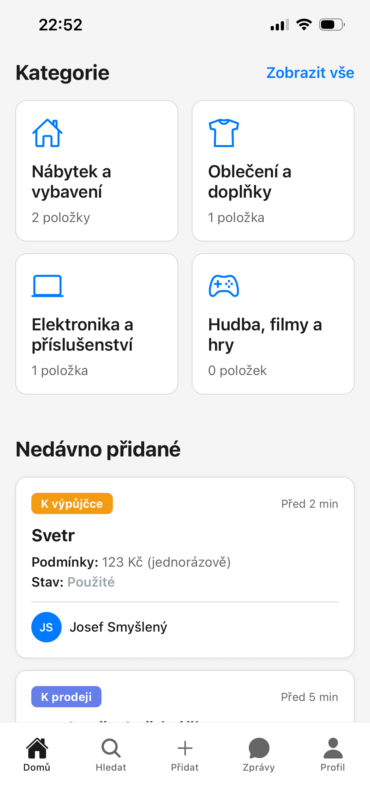
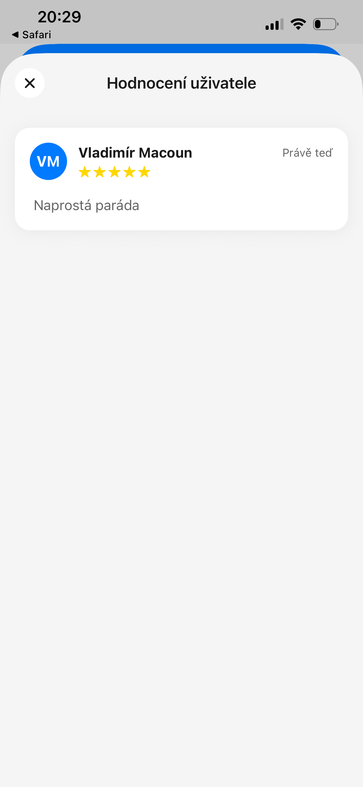

# Přehled aplikace TULmarket

TULmarket je mobilní aplikace sloužící jako inzertní portál pro studenty a zaměstnance Technické univerzity v Liberci. Umožňuje nakupovat, prodávat nebo si půjčovat studijní literaturu, vybavení na koleje a další studentské potřeby přímo v kampusu.

Přístup do aplikace vyžaduje platný TUL účet – registrace přes cizí e-mail není možná.

Obr.: Domovská obrazovka s hlavní nabídkou kategorií a nedávno přidanými inzeráty

## Typy inzerátů

Při vytváření inzerátu volíš jeden ze tří typů. Typ ovlivňuje, jaké údaje je potřeba vyplnit.

| Typ | Použití | Co vyplňuješ navíc |
| --- | --- | --- |
| **Prodej** | Jednorázový převod zboží za peníze | Cena v Kč nebo „Cena dohodou" |
| **Půjčení** | Dočasné zapůjčení zboží za poplatek | Cena za období, dostupnost do data |
| **Výměna** | Výměna zboží za jiný předmět bez peněz | Co požaduješ, nebo „Otevřen různým nabídkám" |

## Stavy inzerátu

Každý inzerát se nachází v jednom ze tří stavů.

| Stav | Význam |
| --- | --- |
| **Aktivní** | Inzerát je viditelný, zboží je dostupné |
| **Čeká na potvrzení** | Prodávající zahájil předání, kupující ještě nepotvrdil převzetí |
| **Dokončeno** | Transakce je uzavřena, zboží není dostupné |

Inzeráty ve stavu **Čeká na potvrzení** a **Dokončeno** se ve vyhledávání nezobrazují. Na profilu prodávajícího zůstávají viditelné v archivu.

## Systém hodnocení uživatelů

Po každém dokončeném obchodu mohou obě strany ohodnotit protistranu – podobně jako na běžných trzištích (Vinted, Marketplace).

- **Stupnice:** 1–5 hvězdiček + volitelný textový komentář.
- **Kdy hodnotit:** Po dokončení transakce se v chatu zobrazí tlačítko **Hodnotit**.
- **Viditelnost:** Hodnocení jsou veřejně viditelná na profilu každého uživatele.

Obr.: Ukázka veřejného profilu uživatele s uděleným hodnocením a komentáři

Prodejci s vysokým hodnocením jsou důvěryhodnější – kupující se mohou na základě hodnocení lépe rozhodovat.

## Bezpečné obchodování

TULmarket funguje na principu osobního předání v kampusu. Aby proběhlo vše bez problémů:

- Setkávej se na **veřejných místech** v kampusu – menza, chodby fakult, prostory kolejí.
- **Nikdy neplať předem** za zboží, které jsi neviděl/a.
- Zboží si **fyzicky prohlédni** před předáním peněz.
- Komunikuj **výhradně přes aplikaci** – osobní kontaktní údaje si vyměňuj až po prověření profilu protistrany.
- V případě podezřelého chování využij funkci **Nahlásit uživatele** na profilu uživatele.
