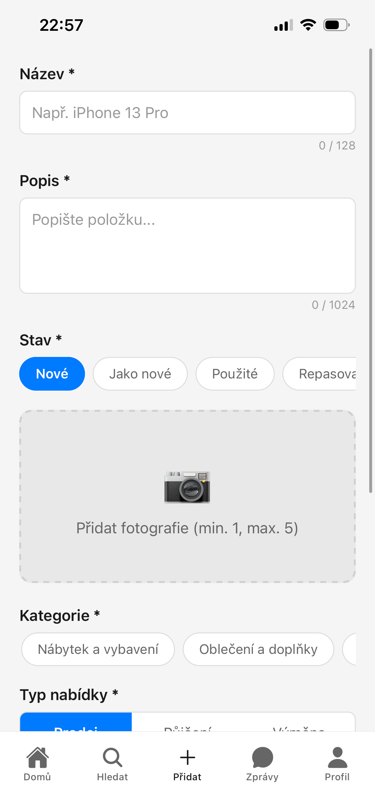
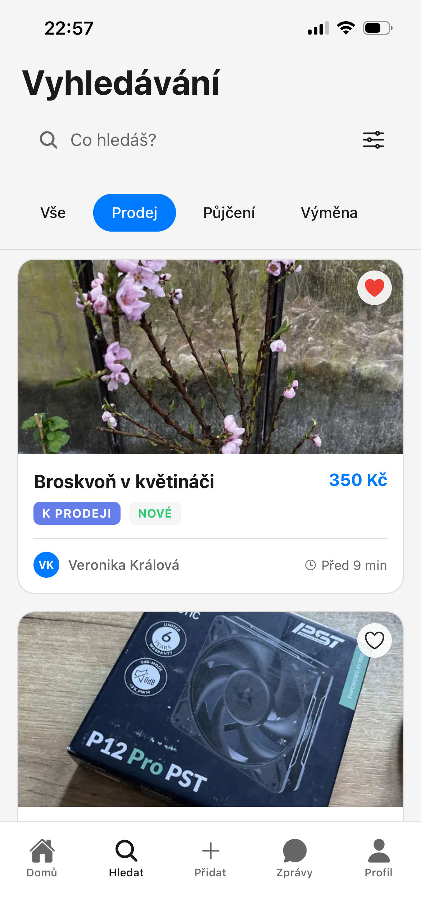
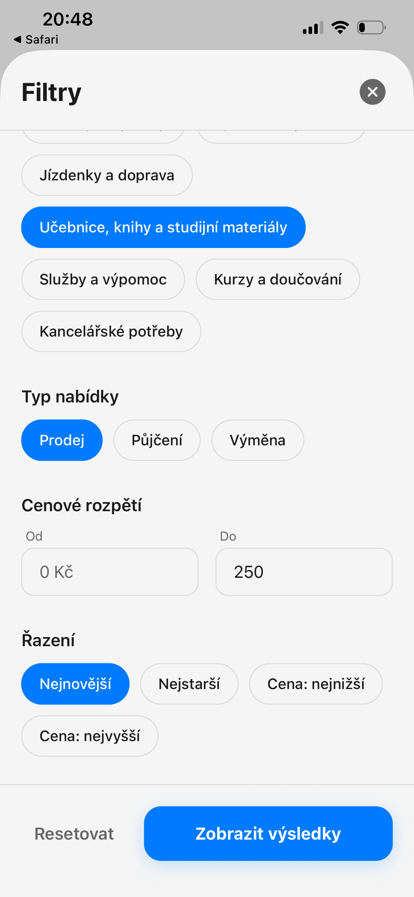
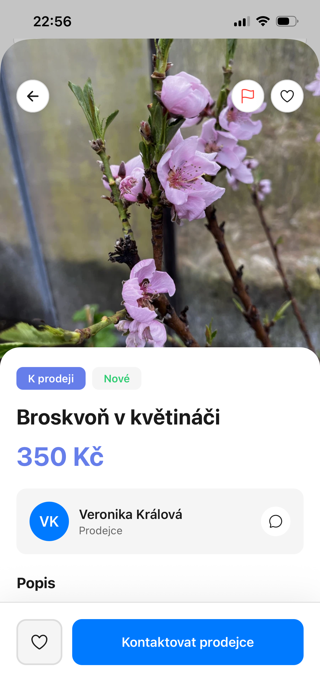
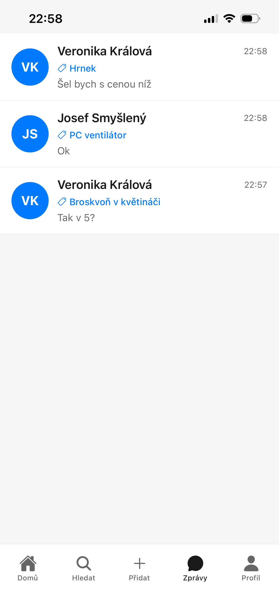
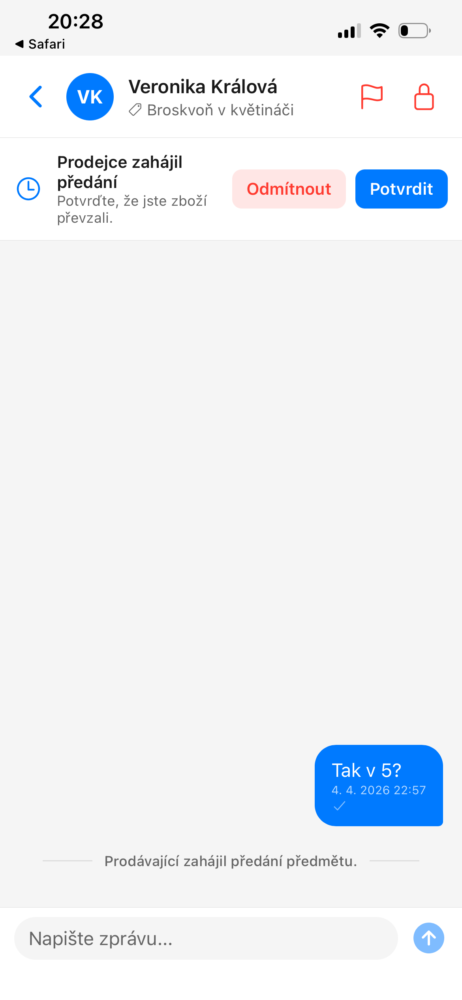
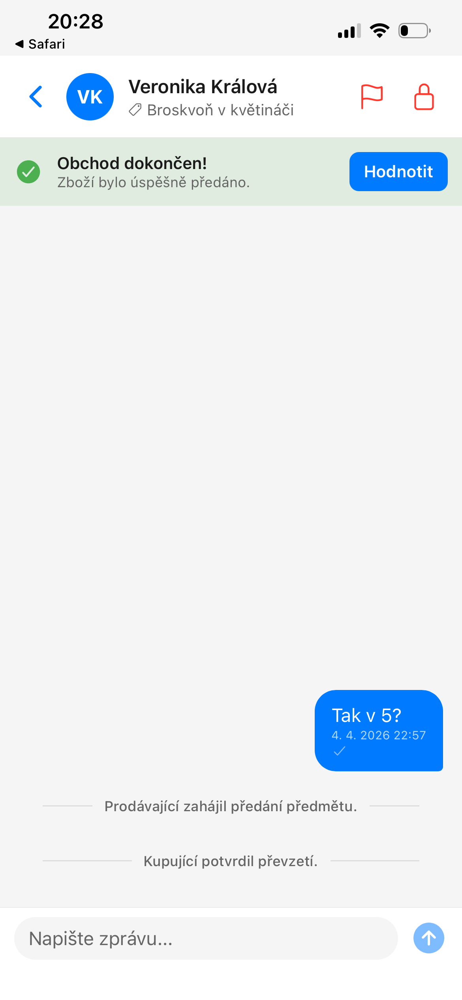
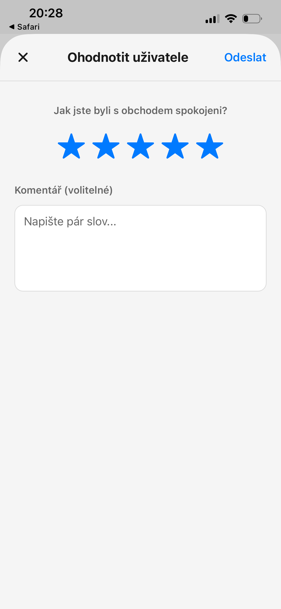
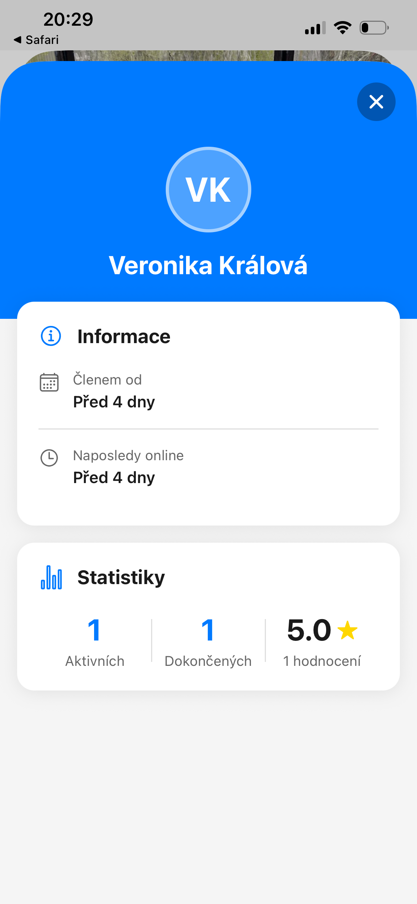
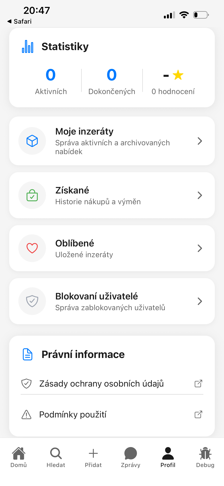

# Postupy

Každý postup uvádí, co musíš mít splněno předem, a popisuje jednotlivé kroky v pořadí, jak jdou za sebou. Sekce *Řešení problémů* na konci postupu ti pomůže, pokud něco nefunguje.

---

## 1. Přihlášení do aplikace

**Předpoklad:** platný TUL účet (student nebo zaměstnanec TUL) a aplikace TULmarket nainstalovaná v telefonu.

1. Otevři aplikaci TULmarket.
2. Klepni na **Přihlásit se přes TUL účet**.
3. Zadej přihlašovací údaje TUL – stejné jako do školního e-mailu nebo IS/STAG.
4. Pokud je na účtu zapnuté dvoufaktorové ověření, potvrď ho v autentizační aplikaci.
5. Po přesměrování zpět do aplikace jsi přihlášen/a.

Při prvním přihlášení se profil vytvoří automaticky. Jméno a e-mail se přeberou z TUL účtu.

::: details Řešení problémů
**Přihlášení selže.** Zkontroluj, že zadáváš TUL přihlašovací údaje, ne přihlašovací údaje k soukromému účtu.

**Přihlašovací stránka se neotevře.** Zkontroluj připojení k internetu, zavři aplikaci a otevři ji znovu.
:::

---

## 2. Vytvoření inzerátu

**Předpoklad:** jsi přihlášen/a do aplikace.

1. Klepni na **Přidat** (ikona +) v dolní liště.
2. Vyplň **Název** zboží (max. 128 znaků).
3. Vyplň **Popis** – uveď stav, důvod prodeje a další informace (max. 1024 znaků).
4. Vyber **Stav** předmětu: *Nové*, *Jako nové*, *Použité* nebo *Repasované*.
5. Klepni na **Přidat fotografie** a vyber 1–5 snímků z galerie nebo vyfoť přímo.
6. Vyber **Kategorii** ze seznamu.
7. Vyber **Typ nabídky** a vyplň příslušné údaje:
   - **Prodej:** zadej cenu v Kč, nebo zaškrtni *Cena dohodou*
   - **Půjčení:** zadej cenu za období a datum, do kdy je zboží dostupné
   - **Výměna:** zadej, za co chceš vyměnit, nebo zaškrtni *Otevřen různým nabídkám*
8. Klepni na **Zveřejnit**.

Obr.: Formulář pro přidání inzerátu s výběrem typu a nahráním fotografií

::: tip Tipy pro lepší inzerát
Vyfoť zboží na světlém, neutrálním pozadí. Přilož fotografii případného poškození – předejdeš tak nedorozuměním při předání.
:::

::: details Řešení problémů
**Tlačítko Zveřejnit je neaktivní.** Zkontroluj, že jsou vyplněna všechna povinná pole – název, kategorie, typ a alespoň jedna fotografie.
:::

---

## 3. Vyhledávání a filtrování zboží

**Předpoklad:** jsi přihlášen/a do aplikace.

### Vyhledávání podle názvu

1. Klepni na **Hledat** v dolní liště.
2. Zadej hledaný výraz do pole **Co hledáš?**, například „Matematická analýza" nebo „lampička".
3. Výsledky se aktualizují průběžně při psaní.
4. Pro rychlé filtrování podle typu použij záložky **Vše / Prodej / Půjčení / Výměna** pod vyhledávacím polem.

Obr.: Obrazovka vyhledávání s průběžnými výsledky a přepínáním typu nabídky

::: tip
Pokud nenajdeš co hledáš, zkus kratší nebo obecnější výraz.
:::

### Filtrování a řazení výsledků

1. Klepni na ikonu **filtru** vpravo od vyhledávacího pole.
2. Nastav jeden nebo více filtrů:

   | Filtr | Možnosti |
   | --- | --- |
   | **Kategorie** | Učebnice a studijní materiály / Kurzy a doučování / Kancelářské potřeby / Elektronika a příslušenství / Nábytek a vybavení / Oblečení a doplňky / Hudba, filmy a hry / Sportovní vybavení / Jízdenky a doprava / Služby a výpomoc |
   | **Typ nabídky** | Prodej / Půjčení / Výměna |
   | **Cenové rozpětí** | Minimální a maximální cena v Kč |
   | **Řazení** | Nejnovější / Nejstarší / Cena: nejnižší / Cena: nejvyšší |

3. Klepni na **Zobrazit výsledky**.

Obr.: Panel s rozšířenými filtry a možnostmi řazení pro zpřesnění výsledků

Filtry lze libovolně kombinovat. Pro zrušení všech filtrů klepni na **Resetovat**.

---

## 4. Kontaktování prodejce

**Předpoklad:** jsi přihlášen/a a máš otevřený detail inzerátu jiného uživatele.

### Zahájení konverzace

1. Otevři detail inzerátu.
2. Prohlédni si fotografie, popis a profil prodejce.
3. Klepni na **Kontaktovat prodejce**.
4. Napiš zprávu – uveď zájem o zboží a navrhni místo a čas předání.
5. Klepni na **Odeslat**.

Obr.: Detail inzerátu zobrazující fotky, popis a tlačítko pro kontaktování prodejce

### Pokračování v konverzaci

1. Klepni na **Zprávy** v dolní liště.
2. Vyber konverzaci ze seznamu.
3. Napiš zprávu a klepni na **Odeslat**.

Obr.: Zobrazení seznamu aktivních konverzací s nabídkami

::: details Řešení problémů
**Tlačítko Kontaktovat prodejce se nezobrazuje.** Prohlížíš vlastní inzerát – na vlastní inzeráty zprávu poslat nelze.

**Zpráva se neodeslala.** Zkontroluj připojení k internetu a zkus znovu.
:::

---

## 5. Předání zboží a dokončení transakce

**Předpoklad:** jsi přihlášen/a, máš aktivní inzerát a v chatu jsi se dohodl/a s kupujícím na předání.

### Zahájení předání (prodávající)

1. V chatu s kupujícím klepni na **Předat**.
2. Předej zboží osobně kupujícímu.
3. Kupující potvrdí převzetí v aplikaci – viz níže.

Obr.: Výzva k potvrzení v chatu, která se zobrazí kupujícímu po iniciaci předání prodejcem

### Potvrzení převzetí (kupující)

1. V chatu se ti zobrazí výzva **Prodejce zahájil předání**.
2. Po fyzickém převzetí zboží klepni na **Potvrdit**.

Obchod je dokončen. V chatu se zobrazí zpráva **Obchod dokončen! Zboží bylo úspěšně předáno.** a tlačítko **Hodnotit** pro ohodnocení protistrany.

Obr.: Potvrzení o dokončení obchodu po převzetí a zpřístupnění hodnocení

### Zrušení předání

Předání může zrušit kupující klepnutím na **Odmítnout**, nebo prodávající klepnutím na **Zrušit předání** v chatu. Inzerát se vrátí do stavu Aktivní.

::: details Řešení problémů
**Kupující nepotvrzuje převzetí.** Připomeň mu to přes chat. Pokud situaci nelze vyřešit, může prodávající předání zrušit – inzerát se znovu aktivuje a lze ho nabídnout jinému zájemci.
:::

---

## 6. Hodnocení protistrany

**Předpoklad:** transakce je dokončena.

1. V chatu klepni na **Hodnotit** v banneru *Obchod dokončen!*
2. Vyber hodnocení 1–5 hvězdiček.
3. Volitelně přidej komentář.
4. Klepni na **Odeslat** vpravo nahoře.

Obr.: Formulář pro udělení hodnocení a sepsání zkušenosti po úspěšném předání

Pro zobrazení hodnocení jiného uživatele klepni na jeho jméno nebo fotografii – zobrazí se profil s průměrným hodnocením a komentáři.

Obr.: Zobrazení veřejného profilu jiného uživatele s jeho průměrným hodnocením a komentáři

---

## 7. Úprava a smazání inzerátu

**Předpoklad:** jsi přihlášen/a a máš alespoň jeden vlastní inzerát.

Obr.: Vlastní profilová stránka s přehledem aktivních a prodaných inzerátů

### Úprava inzerátu

1. Klepni na **Profil** v dolní liště.
2. Klepni na **Moje inzeráty**.
3. Klepni na inzerát, který chceš upravit.
4. Klepni na ikonu **tužky** vpravo nahoře.
5. Uprav potřebná pole – název, popis, cenu nebo fotografie.
6. Klepni na **Uložit změny**.

### Smazání inzerátu

1. Klepni na **Profil** v dolní liště.
2. Klepni na **Moje inzeráty**.
3. Klepni na inzerát, který chceš smazat.
4. Klepni na ikonu **koše**.
5. Potvrď smazání.

::: warning Pozor
Smazaný inzerát nelze obnovit.
:::

---

## 8. Oblíbené inzeráty

**Předpoklad:** jsi přihlášen/a do aplikace.

### Přidání do oblíbených

1. Otevři detail inzerátu.
2. Klepni na ikonu **srdce** vpravo nahoře.

Inzerát se uloží do seznamu oblíbených.

### Zobrazení oblíbených

1. Klepni na **Profil** v dolní liště.
2. Klepni na **Oblíbené**.

### Odebrání z oblíbených

1. Otevři detail inzerátu.
2. Klepni na ikonu **srdce** vpravo nahoře – inzerát se odebere ze seznamu.

::: info
Pokud je inzerát v oblíbených označen jako prodaný, odebere se automaticky.
:::
